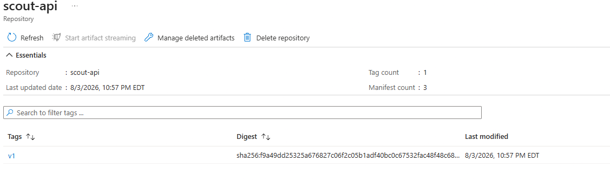

# Screenshots

### Azure Deployment

Scout's production resources running in Microsfot Azure.

### API Health Check

The deployed Express API responding successfully from Azure Container Apps.

### Scheduled Job Execution

Successful scheduled executions of Scout's automated job discovery pipeline.

### Container Registry

The Scout V1 Docker image stored in Azure Container Registry.